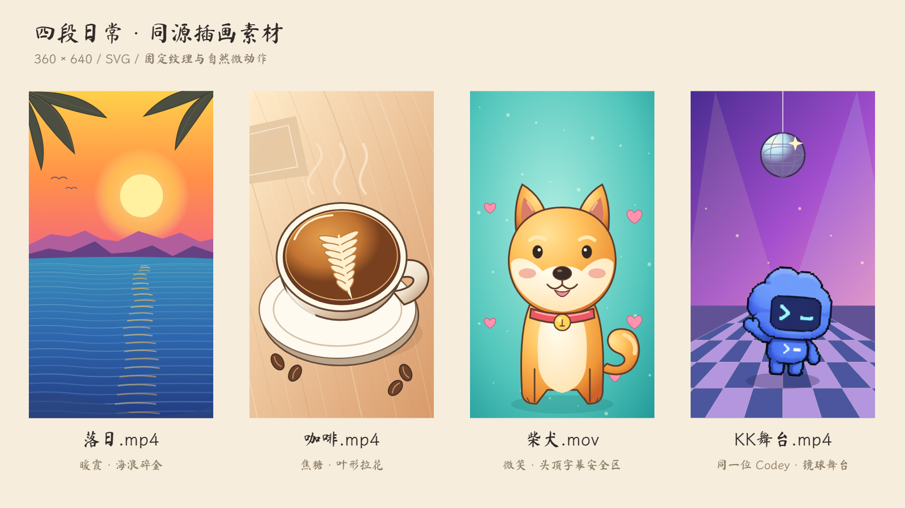

<h1 align="center">KK-Codex Animation</h1>

<p align="center">30 秒手绘剪辑动画，可修改、可重新渲染。</p>

<p align="center">
  
</p>

<p align="center">
  <a href="https://github.com/kkfor30/kk-codex-animation/releases/latest">完整视频</a> ·
  <a href="docs/PRODUCTION-PROMPT.md">制作 Prompt</a> ·
  <a href="docs/PRODUCTION-PROMPT.txt">TXT 下载</a>
</p>

## 成片

Codey 搬素材、裁废片、加转场、改字幕、调参数、卡点导出。**源码对应这条 30 秒成片。**

https://github.com/user-attachments/assets/b84b018b-1c78-45d0-bb93-b89c0b446489

<details>
<summary>26 秒社媒参考版</summary>

故事与视觉参考；本仓库仅包含上方 30 秒版本的制作工程。

https://github.com/user-attachments/assets/811f388f-dafe-4bc1-850d-34c927d81f2f

</details>

## 运行

需要 Node.js、Python 和 FFmpeg / ffprobe。首次下载角色与字体需要联网。

```bash
git clone https://github.com/kkfor30/kk-codex-animation.git
cd kk-codex-animation
npm ci
python -m pip install -r requirements.txt
npm run assets
npm run artwork
npm run studio
```

渲染：`npm run render` → `out/KK-Codex-30s.mp4`。

<details>
<summary>检查与音频生成</summary>

```bash
npm run typecheck
npm run check
npm run verify  # 渲染后检查成片
npm run audio   # 重新生成音乐、音效与混音
```

工程已包含音乐与音效，可直接渲染。[验证记录](docs/VALIDATION.md)

</details>

## 修改

| 想改什么 | 入口 |
| --- | --- |
| 动作、时序、镜头 | [story.ts](src/story.ts) · [events.json](src/events.json) |
| 角色与四段插画 | [CodeyRig.tsx](src/components/CodeyRig.tsx) · [Artwork.tsx](src/components/Artwork.tsx) |
| 剪辑台与片尾界面 | [Workspace.tsx](src/components/Workspace.tsx) · [SocialViewer.tsx](src/components/SocialViewer.tsx) |
| 配乐与音效 | [audio.py](scripts/audio.py) |

<details>
<summary>四段 SVG 素材预览</summary>



</details>

## 许可

自制代码、SVG 场景与合成音频采用 [MIT](LICENSE)。Codey、字体及依赖保留各自许可，见 [第三方声明](THIRD_PARTY_NOTICES.md)。

[反馈问题](https://github.com/kkfor30/kk-codex-animation/issues) · [贡献指南](CONTRIBUTING.md)
